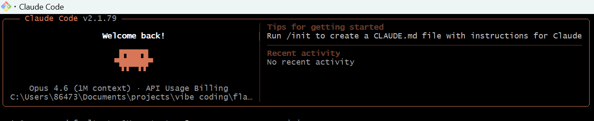
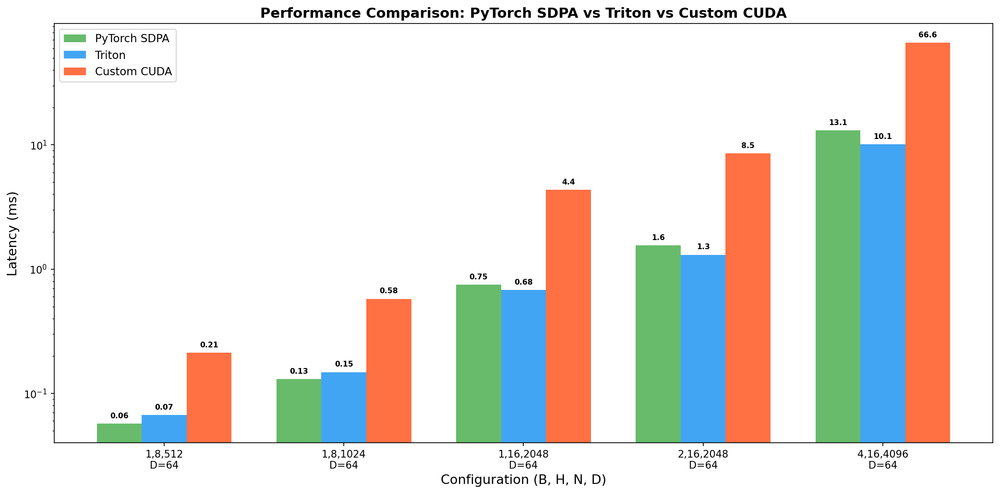
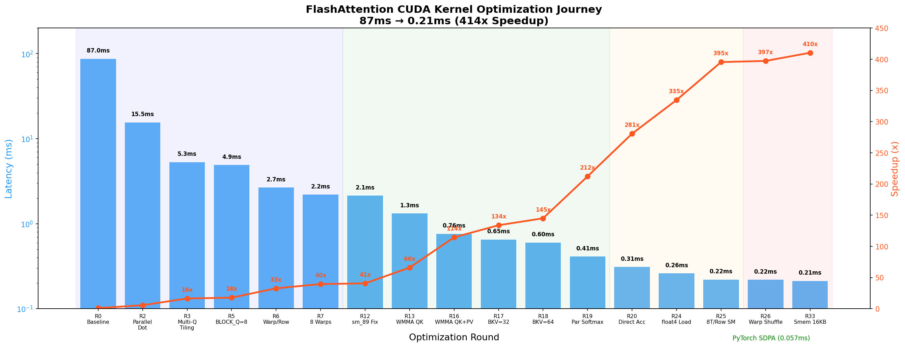
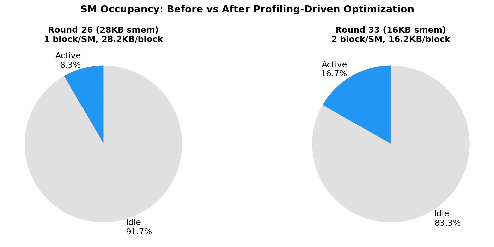
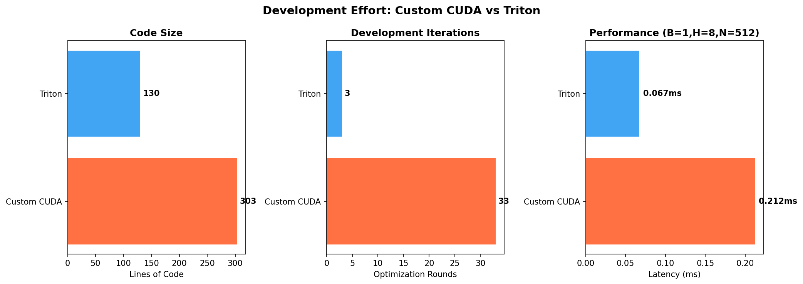

# Vibe Coding: FlashAttention 算子优化实战

刚开始用的MiniMax 2.5模型搭的框架和脚本，也实现了手写的cuda算子，但性能优化到87ms死活优化不下去了，所以斥巨资请来了Opus4.6, 果然一分价钱一分货。
从零手写 CUDA FlashAttention 算子，经过 33 轮迭代优化，从 87ms 优化到 0.21ms（414x 加速）。同时实现 Triton 版本作为对比，~130 行 Python 达到甚至超越 PyTorch SDPA 的性能。

## 目的

1. 深入理解 FlashAttention v2 的算法原理和 GPU 优化技术
2. 实践 CUDA kernel 优化的完整流程：Tensor Core (WMMA)、shared memory 管理、warp shuffle、向量化访存等
3. 对比手写 CUDA、Triton、PyTorch SDPA 三种实现的开发效率与运行性能

## 结论

### 最终性能对比（RTX 4060 Laptop, fp16）



| Config (B,H,N,M,D) | PyTorch SDPA | Triton | Custom CUDA |
|---------------------|-------------|--------|-------------|
| 1,8,512,512,64 | 0.057ms | 0.067ms | 0.212ms |
| 1,8,1024,1024,64 | 0.130ms | 0.148ms | 0.576ms |
| 1,16,2048,2048,64 | 0.747ms | 0.681ms | 4.356ms |
| 2,16,2048,2048,64 | 1.551ms | 1.306ms | 8.522ms |
| 4,16,4096,4096,64 | 13.059ms | 10.104ms | 66.567ms |

### 核心发现

- **手写 CUDA**: 303 行代码，33 轮优化，87ms → 0.21ms（414x），但仍比 PyTorch 慢 3.7x
- **Triton**: 130 行 Python，大配置上比 PyTorch SDPA 快 22%，开发效率远超手写 CUDA
- **瓶颈分析**: 手写 CUDA 的主要差距来自 shared memory 占用限制 occupancy、缺少 software pipelining、以及 softmax 标量操作无法利用 Tensor Core

### 精度

三种实现 vs PyTorch SDPA 参考输出的 max_abs_diff 均为 0.000122~0.000244（fp16 精度范围内）。

## 项目结构

```
flashattention/
├── ccsrc/
│   └── flash_attention_fwd.cu    # 手写 CUDA kernel (303行)
├── python/
│   ├── attention.py              # Python 绑定 + benchmark 框架
│   └── triton_flash_attn.py      # Triton 实现 (130行)
├── logs/
│   ├── perf_log.md               # 详细性能日志
│   ├── cuda_optimization_journey.png  # CUDA优化历程图
│   ├── three_way_comparison.png   # 三方性能对比图
│   ├── performance_ratio.png      # 性能比率图
│   ├── occupancy_comparison.png   # Occupancy对比图
│   └── dev_effort_comparison.png  # 开发效率对比图
├── profile_kernel.py             # Kernel occupancy 分析脚本
├── setup.py                      # CUDA 编译配置
└── run.py                        # 运行入口
```

## 使用方法

### 环境要求

- Python 3.11+
- PyTorch 2.0+ (with CUDA)
- CUDA Toolkit 12.x
- Triton 3.0+（Triton 测试需要）
- NVIDIA GPU (sm_89 tested, RTX 40 series)

### 编译 CUDA kernel

```bash
cd flashattention
python setup.py build_ext --inplace
```

### 运行测试

```bash
# 全部测试（正确性 + 性能）
python run.py

# 仅正确性测试
python run.py --correctness

# 仅性能测试
python run.py --performance

# 指定配置 (B H N M D)
python run.py --performance --config 1 8 512 512 64
```

### Triton 测试（Windows 需设置编译器环境）

```bash
# Windows 需要设置 MSVC 环境变量
set INCLUDE=C:/Program Files/Microsoft Visual Studio/2022/Community/VC/Tools/MSVC/14.44.35207/include;C:/Program Files (x86)/Windows Kits/10/Include/10.0.26100.0/ucrt;C:/Program Files (x86)/Windows Kits/10/Include/10.0.26100.0/shared;C:/Program Files (x86)/Windows Kits/10/Include/10.0.26100.0/um
set LIB=C:/Program Files/Microsoft Visual Studio/2022/Community/VC/Tools/MSVC/14.44.35207/lib/x64;C:/Program Files (x86)/Windows Kits/10/Lib/10.0.26100.0/ucrt/x64;C:/Program Files (x86)/Windows Kits/10/Lib/10.0.26100.0/um/x64
set CC=C:/Program Files/Microsoft Visual Studio/2022/Community/VC/Tools/MSVC/14.44.35207/bin/Hostx64/x64/cl.exe

python run.py --performance
```

## 优化迭代记录



### 第一阶段：基础优化（87ms → 2.14ms, 40x）

| Round | 优化项 | 性能 | 加速比 | 说明 |
|-------|--------|------|--------|------|
| 0 | 基础实现 | 87ms | 1x | 单线程逐元素计算 |
| 1 | 多种尝试 | 87ms | 1x | 256线程、常量内存、循环展开等均无效 |
| 2 | 线程并行 dot product | 15.5ms | 5.6x | 128线程并行计算，warp+shared memory reduction |
| 3 | 多Q行 tiling | 5.3ms | 16.4x | BLOCK_Q=4, 每线程对应一个D维度 |
| 4 | 单warp kernel | 7.3ms | - | ❌ 32线程加载太慢 |
| 5 | BLOCK_Q=8 + __expf | 4.9ms | 17.8x | 增大Q tile + 快速数学函数 |
| 6 | Warp-per-Q-row | 2.66ms | 32.7x | 每warp独立处理一个Q行，热循环无sync |
| 7 | 8 warps per block | 2.20ms | 39.5x | 256线程提高occupancy |
| 8-11 | 多种尝试 | 2.2-5.8ms | - | bank conflict padding、lane-per-KV等均无效 |
| 12 | 修复编译架构 | 2.14ms | 40.7x | sm_80→sm_89, 去掉寄存器限制 |

### 第二阶段：Tensor Core（2.14ms → 0.31ms, 280x）

| Round | 优化项 | 性能 | 加速比 | 说明 |
|-------|--------|------|--------|------|
| 13 | WMMA QK^T | 1.32ms | 65.9x | 16x16x16 Tensor Core 计算 QK^T |
| 14-15 | WMMA 扩展尝试 | 1.5-1.8ms | - | ❌ 4 warps WMMA、BLOCK_KV=32 均更慢 |
| 16 | WMMA QK^T + PV | 0.76ms | 114.5x | P×V 也用 Tensor Core |
| 17 | BLOCK_KV=32 | 0.65ms | 133.8x | 2个WMMA tile，迭代减半 |
| 18 | BLOCK_KV=64 | 0.60ms | 145x | 4个WMMA tile，4 warps 全参与 |
| 19 | 并行化 softmax | 0.41ms | 212x | 128线程全部参与 softmax 计算 |
| 20 | WMMA 直接累加 O_acc | 0.31ms | 280.6x | 省掉 O_tile 中间缓冲 |

### 第三阶段：精细优化（0.31ms → 0.22ms, 395x）

| Round | 优化项 | 性能 | 加速比 | 说明 |
|-------|--------|------|--------|------|
| 21-22 | 多种尝试 | 0.33-0.39ms | - | 8 warps、S/P共享内存、sync合并均无效 |
| 23 | K/V 共用 shared memory | 0.345ms | - | ❌ 多一次V加载抵消收益 |
| 24 | float4 向量化加载 | 0.26ms | 334.6x | 128-bit 向量化 global memory 访问 |
| 25 | 8 threads/row softmax | 0.22ms | 395.5x | 全部128线程参与softmax reduce |
| 26 | Warp shuffle reduce | 0.219ms | 395.5x | 省shared memory，性能持平 |
| 27 | Double buffer K | 0.306ms | - | ❌ shared memory 增加降低 occupancy |
| 28 | K/V 共用 smem (20KB) | 0.232ms | - | ❌ 额外V加载+sync |
| 29 | BLOCK_Q=32 | 0.228ms | - | ❌ 256线程+40KB smem 无提升 |

### 第四阶段：Triton 实现

| Round | 优化项 | 性能 (N=4096) | 说明 |
|-------|--------|--------------|------|
| 30 | Triton 基础实现 | 11.044ms | ~130行Python，tl.dot 自动用 Tensor Core |
| 31 | Autotune | 10.148ms | 10种配置自动选择最优 tile size |
| 32 | Pre-scale Q + EVEN mask | 10.392ms | 预缩放Q + 条件mask，效果有限 |

### 第五阶段：Profiling 驱动优化（0.22ms → 0.21ms）



使用 torch profiler 和 occupancy 分析工具（ncu 需要管理员权限），发现核心瓶颈：

```
Occupancy: 8.3% (4/48 warps active per SM)
原因: shared memory 28KB/block, 48KB/SM 只能放 1 个 block
```

| Round | 优化项 | 性能 | 说明 |
|-------|--------|------|------|
| 33 | K/V共用buffer + S_float复用KV空间 | 0.212ms | smem 28KB→16KB, occupancy 8.3%→16.7% |

关键改动：WMMA 计算 QK^T 后 sync，将结果写入 KV_tile 区域（K 已不需要），softmax 完成后再加载 V。N=1024 配置提升 31%（0.830→0.576ms）。

## 关键技术总结

### 有效的优化

1. **Tensor Core (WMMA)**: 最大单次提升，QK^T 和 PV 都用 16x16x16 矩阵乘
2. **并行化 softmax**: 128线程全参与，8 threads/row + warp shuffle reduce
3. **向量化访存**: float4 (128-bit) 加载 K/V，减少 global memory 事务
4. **Tile size 调优**: BLOCK_KV=64 是最优平衡点（shared memory vs 迭代次数）
5. **消除中间缓冲**: WMMA 直接累加到 O_acc，省掉 O_tile
6. **Profiling 驱动的 smem 优化**: 通过 occupancy 分析发现瓶颈，K/V 共用 buffer 将 smem 从 28KB 降到 16KB，occupancy 翻倍

### 无效的优化

1. **Double buffering**: shared memory 增加反而降低 occupancy
2. **K/V 共用 shared memory (早期尝试)**: Round 28 时多一次 V 加载 + sync 抵消 occupancy 提升；Round 33 配合 S_float 复用才成功
3. **BLOCK_Q=32**: 256线程 + 40KB shared memory，register 压力过大
4. **Bank conflict padding**: 对当前访问模式无效
5. **常量内存、循环展开**: 编译器已自动优化

### Triton vs 手写 CUDA



| 维度 | 手写 CUDA | Triton |
|------|----------|--------|
| 代码量 | 303 行 | 130 行 |
| 开发周期 | 31 轮迭代 | 3 轮迭代 |
| 性能 (小配置) | 0.22ms | 0.07ms |
| 性能 (大配置) | 68ms | 10ms |
| Tensor Core | 手动 WMMA | 自动 tl.dot |
| Shared memory | 手动管理 | 编译器自动 |
| Software pipelining | 无 | 编译器自动 (num_stages) |
| Autotune | 无 | 内置支持 |

Triton 编译器自动处理了 tiling、shared memory 管理、software pipelining、register 分配等底层优化，这些正是手写 CUDA 中最难做好的部分。

## 硬件环境

- GPU: NVIDIA GeForce RTX 4060 Laptop GPU (sm_89, Ada Lovelace)
- Shared Memory: 48KB per SM
- CUDA: 12.4
- PyTorch: 2.5.1+cu121
- Triton: 3.0.0
- OS: Windows 11
